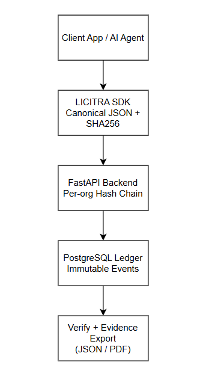

# LICITRA (Core)

Cryptographically Verifiable Runtime Integrity for Agentic AI Systems.

LICITRA provides tamper-evident runtime audit trails for autonomous AI agents using
hash-chained semantic events, PostgreSQL persistence, and forensic evidence exports.

## Architecture


## Key Capabilities
- Deterministic canonical JSON hashing
- Per-organization hash-chained event ledger (SHA-256)
- PostgreSQL persistence
- Verification endpoint (`/verify/{org_id}`)
- Governance evidence bundle export (`/evidence/{org_id}`)
- Dev-only tamper/reset endpoints gated by `DEV_MODE`

## Repo Layout
- `backend/` FastAPI service + database models
- `test-vectors/` deterministic hashing test vectors
- `architecture/` diagrams and design notes
- `docs/` implementation notes (if present)

## Quickstart (Local)
1) Create `.env` from `.env.example`  
2) Set `DATABASE_URL` to your Postgres connection string  
3) Run:
```bash
python -m uvicorn backend.app.main:app --reload

Evidence + Experiments
See: https://github.com/narendrakumarnutalapati/licitra-evidence


